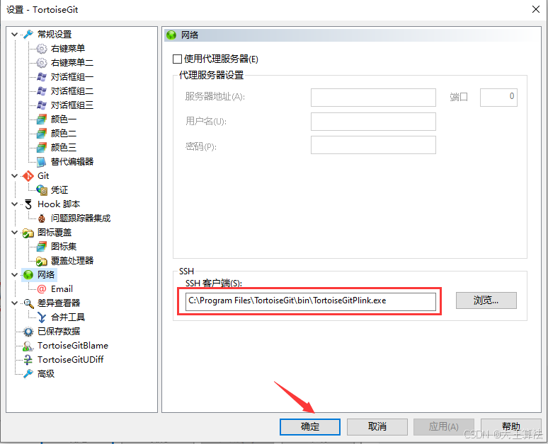
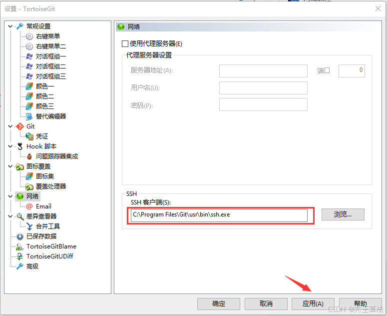

### 解决TortoiseGit提示No supported authentication methods available

修改TortoiseGit的默认网络SSH client执行程序

由于TortoiseGit出现错误，而GitBash可以正常使用，所以GitBash的SSH是正常的。在此将TortoiseGit的SSH client修改为GitBash对应的SSH程序。

选择Git的安装目录下对应的ssh.exe文件即可，如下图所示：

